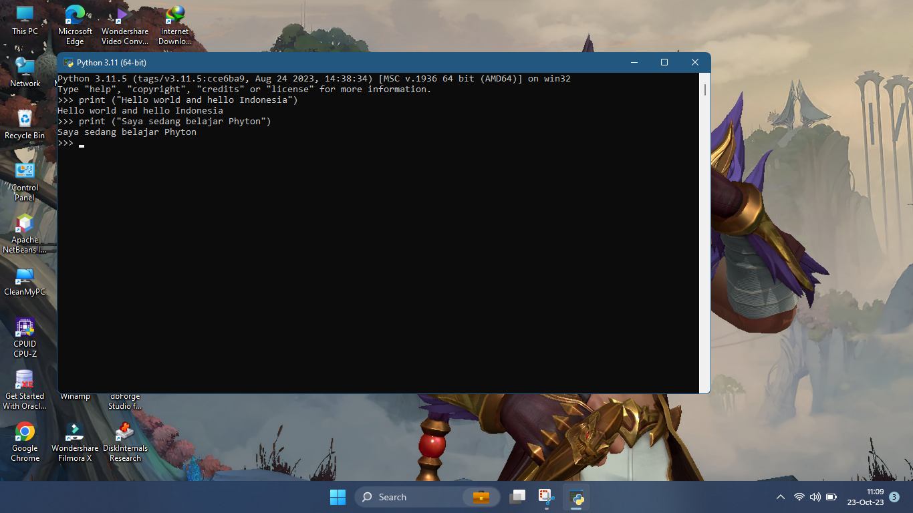
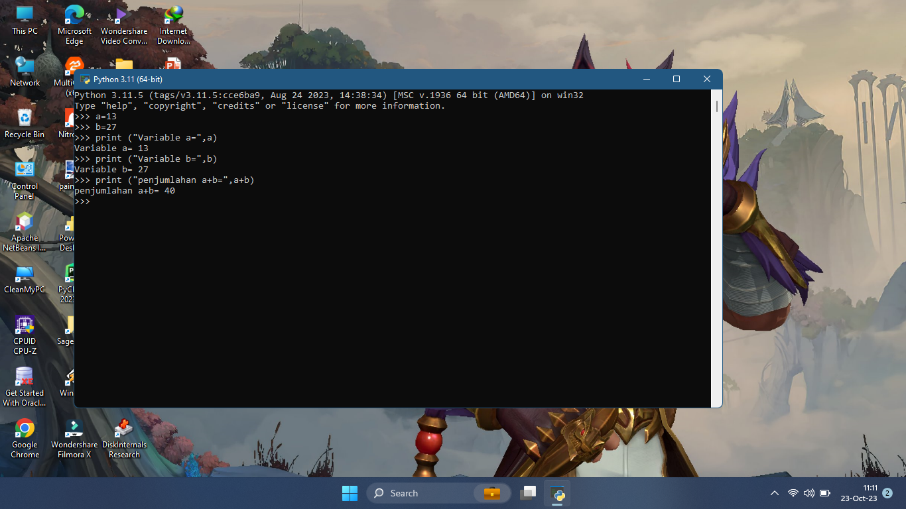
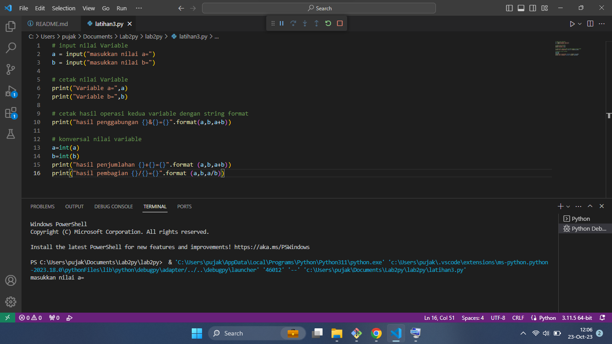

<h1>Latihan 1</h1>

Menjalankan Python Console

Menampilkan tulisan "Hello" dilayar

Menampilkan tulisan "Saya sedang belajar python")

- Buka CMD

- Ketik "python"

- print("Hello world and indonesia")

- print("saya sedang belajar python")

<h1>Latihan 2</h1>

Menjumlahkan dua buah bilangan menggunakan variabel a dan b.

• Mendefinisikan variable a dengan nilai 8

• Mendefinisikan variable a dengan nilai 8

• Mencetak nilai variable a dan b

• Mencetak hasil penjumlahan a+b

<h1>Latihan 3</h1>

Menjalankan IDLE

• Membuat file baru dengan nama latihan3.py (pastikan lokasi file
pada folder lab2py pada direktori kerja anda)

• Menggunakan fungsi input untuk mengambil nilai variabel dari
keyboard.

